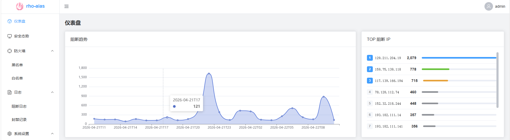
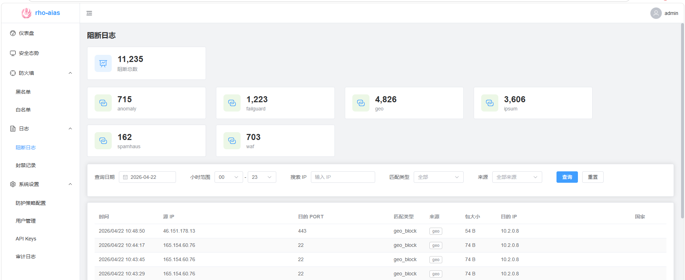
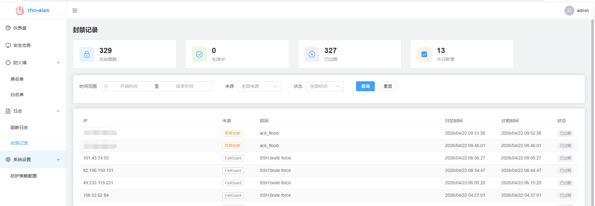
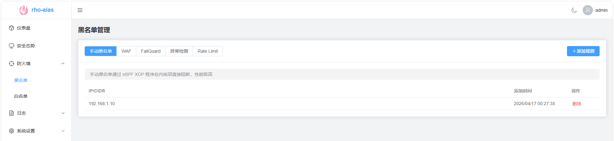
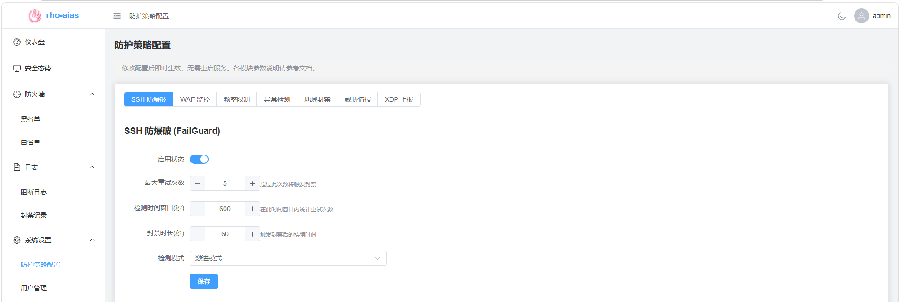

# rho-aias

基于 eBPF/XDP 的高性能网络防火墙系统，在网络驱动层（L3）拦截和过滤数据包。












## 功能特性

- **eBPF XDP 包过滤**：驱动层高性能拦截
- **威胁情报**：IPSum / Spamhaus 等多源黑名单自动同步
- **地域封禁**：GeoIP 国家级白名单/黑名单过滤
- **手动规则**：支持通过 API 添加 IP/CIDR 封禁规则
- **WAF 联动**：监控 Caddy + Coraza WAF 日志，自动封禁恶意 IP
- **SSH 防爆破**：类 fail2ban 机制，自动检测并封禁暴力破解
- **异常流量检测**：SYN Flood / UDP Flood / ICMP Flood / ACK Flood 等攻击自动识别与阻断
- **频率限制联动**：监控 Rate Limit 日志，高频请求自动封禁
- **RESTful API**：完整的管理接口（JWT 认证 + RBAC 权限控制）
- **持久化存储**：规则自动落盘，支持离线启动

## 快速开始

### 系统要求

| 要求 | 说明 |
|------|------|
| Linux 内核 | **5.10+**（需支持 XDP 与 BTF） |
| Docker | **24.0+** 及 Docker Compose v2 |
| 网络权限 | 需 `host` 网络模式 + 特定 Linux Capability |
| 网卡 | 需确认本机网卡名称（如 `ens33`、`eth0`） |

> ⚠️ 本项目依赖 eBPF XDP 技术，**仅支持 Linux 系统**，不支持 macOS / Windows。

### WAF IP 封禁清理机制

WAF 模块通过监控 Caddy + Coraza WAF 日志和 Rate Limit 日志，自动触发 IP 封禁。封禁的完整生命周期如下：

```
日志触发 → banIP() 添加 XDP 封禁规则 → 封禁记录写入内存（带过期时间）
                                                    ↓
                                        cleanupExpiredBans() 每隔 5 分钟扫描
                                                    ↓
                                        过期 IP 移除 XDP 规则 + 清除内存记录
```

> ⚠️ **重要：清理间隔为固定 5 分钟**

`cleanupExpiredBans()` 使用硬编码的 **5 分钟清理间隔**。当封禁到期后，XDP 规则不会立即移除，而是等待下一个清理周期才执行移除。

这意味着实际封禁时长 = `BanDuration` + 最多 5 分钟的清理延迟。

**配置建议：**

| BanDuration | 实际封禁时长范围 | 建议 |
|-------------|------------------|------|
| 30s | 30s ~ 5m30s | ❌ 不推荐，XDP 规则滞留过久 |
| 60s | 60s ~ 6m | ⚠️ 清理延迟占比过大 |
| 300s（5 分钟） | 5m ~ 10m | ✅ 可接受 |
| 600s（10 分钟） | 10m ~ 15m | ✅ 推荐 |
| 3600s（1 小时，默认） | 1h ~ 1h5m | ✅ 推荐 |

**最佳实践：** 建议将 `ban_duration` 设置为 **300 秒（5 分钟）或更长**，使清理延迟在整体封禁时长中的占比合理。

### 封禁记录状态管理

系统启动时会自动将所有 `active` 状态的封禁记录更新为 `auto_unblock` 状态，原因是 eBPF map 存储在内核内存中，系统重启后状态丢失。

封禁记录状态说明：
- `active` - 生效中
- `expired` - 自动过期
- `manual_unblock` - 手动解封（通过管理界面操作）
- `auto_unblock` - 启动时自动解封（eBPF 状态丢失）

> **后续计划**：未来版本可能支持启动时从数据库恢复 active 记录到 eBPF map。

### 使用预构建镜像部署

> 克隆代码后直接在项目目录下执行

```bash
# 直接启动（拉取预构建镜像）,默认账号密码：admin/admin123
docker compose up -d

# 查看日志
docker compose logs -f
```

### 从源码构建部署

```bash
# 从源码构建并启动
docker compose -f docker-compose-build-run.yml up -d --build

# 查看日志
docker compose -f docker-compose-build-run.yml logs -f
```

## 安全说明

- **rho-aias** 容器使用最小权限能力（`CAP_BPF`、`CAP_PERFMON`、`CAP_NET_ADMIN`、`CAP_NET_RAW`），不使用 privileged 模式
- **caddy** 容器仅保留 `NET_BIND_SERVICE` 能力，启用 `no-new-privileges`
- 两个容器均使用 `network_mode: host` 以支持 XDP 驱动层拦截

## 动态配置

系统支持运行时通过 API 热更新以下 6 个模块的核心参数，无需重启服务：

| 模块 | 配置项 | 说明 |
|------|--------|------|
| `failguard` | `enabled`, `max_retry`, `find_time`, `ban_duration`, `mode` | SSH 防爆破 |
| `waf` | `enabled`, `ban_duration` | WAF 日志监控 |
| `rate_limit` | `enabled`, `ban_duration` | 频率限制联动 |
| `anomaly_detection` | `enabled`, `min_packets`, `ports`, `baseline`, `attacks` | 异常流量检测 |
| `geo_blocking` | `enabled`, `mode`, `allowed_countries` | 地域封禁 |
| `intel` | `enabled`, `sources.{name}` | 威胁情报 |

> ⚠️ **重要：动态配置优先级高于 `config.yml`**
>
> 动态配置通过 API 写入后会持久化到数据库（SQLite）。**每次启动时系统会自动从数据库加载动态配置，覆盖 `config.yml` 中对应的字段值。**
>
> 这意味着：
> - 如果通过 API 修改过某模块配置，后续直接编辑 `config.yml` 的对应字段**不会生效**
> - 如需恢复使用 `config.yml` 的值，需通过 API 删除该模块的动态配置或清空数据库
> - 未通过 API 修改过的模块/字段，始终以 `config.yml` 为准

### 配置优先级链

```
config.yml (默认值) → 数据库持久化值 (API 设置) → 运行时内存 (热更新)
                         ↑                              ↑
                    服务启动时覆盖                   API 实时生效（同时回写 DB）
```

# 注意

## 限流缺点

本机发出的流量全部限速，无论是否是主动还是被动。

# 开发

准备环境：

```bash
apt install make llvm clang libbpf-dev
```
